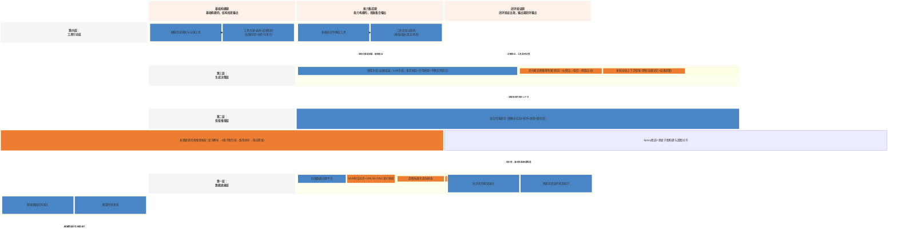

```mermaid
block-beta
    columns 4
    space:1
    P1["基础构建期<br/>基础构建的，结构拒发输出"]:1
    P2["能力集成期<br/>能力构建的，措施集合输出"]:1
    P3["闭环验证期<br/>闭环验证出现，输出期闭环输出"]:1

    %% 第四层
    L4["第四层：<br/>工具行动层"]:1
    block:L4A:1
        G1["健康信息感知与记录工具"]
        G3["工具注册-编排-调用机制<br/>(权限可控+操作可审计)"]
        G1 --> G3
    end
    block:L4B:1
        G2["多模态文件解读工具"]
        G4["三阶段验证矩阵<br/>(基础/临床/真实场景)"]
        G2 --> G4
    end
    space:1

    %% 层间箭头：3->4
    space:1
    space:1
    ARR1["↑ 结构化推理结果→解释表达"]
    ARR2["↑ 诊断结论→工具调用决策"]
    space:1

    %% 第三层
    L3["第三层：<br/>生成决策层"]:1
    block:L3A:3
        F1["受控生成 (证据组装→LLM生成→事实校验+引用溯源+不确定性提示)"]
        block:L3_Sub:2
            F2["贝叶斯诊断推理衔接 (验前→似然比→验后→阈值比对)"]
            F3["多轮动态上下文增强 (跨轮证据记忆+权重调整)"]
        end
    end

    %% 层间箭头：2->3
    space:1
    space:2
    ARR3["↑ 证据组装为提示上下文"]
    space:1

    %% 第二层
    L2["第二层：<br/>检索推理层"]:1
    E1["混合检索服务 (跨模态召回+排序+溯源+置信度)"]:3
    E2["多跳路径检索推理框架 (查询解析→k跳子图剪枝→路径排序→候选答案)"]:3
    E3["Spacy微调+患者子图构建与超图对齐"]:3

    %% 层间箭头：1->2
    space:1
    space:2
    ARR4["↑ 知识库→混合检索/图谱推理"]
    space:1

    %% 第一层
    L1["第一层：<br/>数据底座层"]:1
    block:L1A:1
        D1["四维数据治理平台"]
        D2["GNN时空对齐+UMLS/LOINC语义映射"]
        block:D_Sub:2
            D3["超图标准化指标体系"]
            D4["联盟链跨链模型"]
        end
    end
    block:L1B:1
        D5["知识库检索就绪化"]
        D6["图谱月度迭代机制运行"]
    end
    block:L1C:1
        D7["健康数据回写接入"]
        D8["图谱持续更新"]
    end

    %% 右侧闭环箭头
    space:1
    space:1
    space:1
    ARR5["↓健康数据回写/图谱迭代"]:1

    %% 样式
    classDef phase fill:#fdf2e9,stroke:none,color:#333,font-weight:bold
    class P1,P2,P3 phase
    classDef layerName fill:#f5f5f5,stroke:none,color:#333,font-weight:bold
    class L1,L2,L3,L4 layerName
    classDef engineering fill:#4A86C5,stroke:none,color:#fff
    class G1,G2,G3,G4,F1,E1,D1,D5,D6,D7,D8 engineering
    classDef innovation fill:#ED7D31,stroke:none,color:#fff
    class F2,F3,E2,D2,D3,D4 innovation
    classDef arrowText fill:none,stroke:none,color:#333,font-weight:bold,font-size:12px
    class ARR1,ARR2,ARR3,ARR4,ARR5 arrowText
    classDef subBox fill:#ffffff,stroke:#ED7D31,stroke-width:2px,color:#333
```